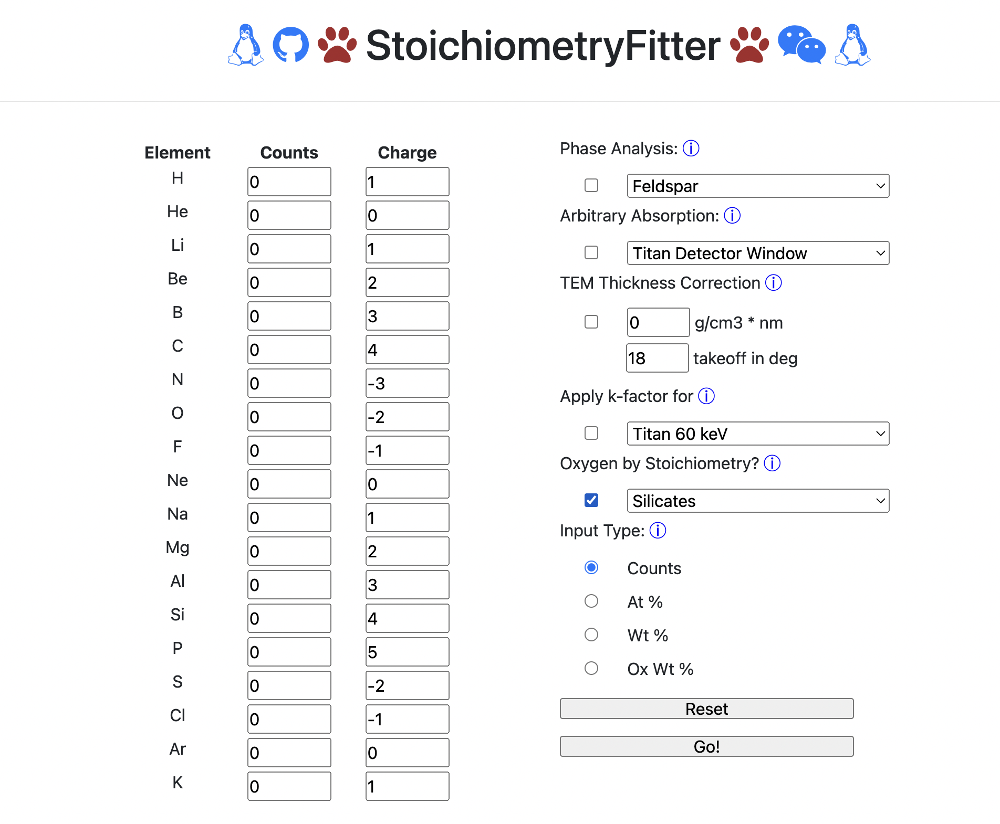

# Summary
This project is based off a GUI(Gainsforth 2016) for fitting solids and analyzing mineral phases. We had developed a software tool for the analysis of multi-phase quantification of materials. One would provide the quantification of elements as input in the form of atomic %, elemental weight % oxide weight % (with cation oxidation states), or as raw counts of TEM measurements. When using raw counts, one could also use the GUI to apply a set of k-factors, a thickness correction, and a detector correction. More of the use cases of the 2016 version are listed in Gainsforth's Previous paper^1. In 2022, we worked on updating Stoichiometry Fitter to the current version, including updating to the latest python version, providing more capabilities, adding more phases, and integreating QMin(Silva et al 2021) a mineral recognition webapp. Then by converting Stoichiometry Fitter from a GUI to web app, our hope is that this tool will be more accessible to the public and will help geologists, minerologists, and chemists alike, make reasearch more efficient and easy when exploring new minerals.

# Statement of need
Stoichiometry Fitter allows a researcher to convert elemental quantification to meaningful conclusions about mineral phases through python scripts. Researchers will then be able to reproduce results on multiple inputs using the same python scripts. The program produces standard outputs for various minerals including Ternary diagrams, diagrams for MORE EXAMPLES, allowing and improving reproducibility for Geologists and researchers on different elemental compositions. Stoichiometry Fitter also allows the user to remove common artifacts from these quantifications simplifiying the understanding process and easing the procedure of mineral analysis. Stoichiometry Fitter is an easy to use program that provides researchers with detailed analyses of a specified mineral. In the case where the researcher is unsure of the mineral that is composed by inputs of element quantifications, our team has integrated QMin(Silva et al 2021) into Stoichiometry Fitter. This allows for researchers to identify and classify new or uknown minerals.

# State of Field
Stoichiometry Fitter allows for the process of analyzing minerals from element quantifications in a much more effecient scale than other programs researchers have used previously for the same kind of analysis. In field of research, many use spreadsheets or excel to write csv files or analyze elemental composition from their inputs. This can be slow and quite in-effecient. Stoichiometry Fitter resolves this issue by presenting a scalable program that can analyze element quantifications from a direct input or a large text file. The program can then output multi-dimensional analysis. Along with the visuals and other integrated features of Stoichiometry Fitter, it allows for a faster and more thorough than many other computational spreadsheet programs.

# Math & Figures

and referenced from text using \autoref{fig:example}.

Chemistry Calculations:

# Citations
pandoc --citeproc paper.bib

# References

- name: Gainsforth, Z. “Stoichiometry Fitter, a GUI for Fitting Solid Solutions and Analyzing Mineral Phases: Microscopy and Microanalysis.” Cambridge Core, Cambridge University Press, 25 July 2016, https://www.cambridge.org/core/journals/microscopy-and-microanalysis/article/stoichiometry-fitter-a-gui-for-fitting-solid-solutions-and-analyzing-mineral-phases/84C98F55BAE56F9BAED27F1681B661C9. 
  index: 1
- name: Silva, Guilherme Ferreira, et al. “Qmin: A Machine Learning-Based Application for Mineral Chemistry Data Processing and Analysis.” 2021, https://doi.org/10.21203/rs.3.rs-629516/v1. 
  index: 2
