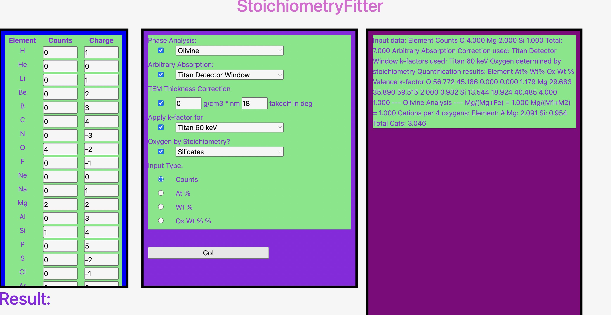

---
title: StoichiometryFitter: An Interactive WebApp for Mineral Analysis
tags:
  - Python
authors:
  - name: Zack Gainsforth
    affiliation: 1
  - name: Michael Ofengenden
    affiliation: 1
  - name: Zhenbang Yu
    affiliation: 1
    
affiliations:
 - name: Space Sciences Laboratory, University of California Berkeley, 7 Gauss Way, USA
   index: 1

date: 15 November 2022
bibliography: paper.bib

## Summary
In 2016, Zack Gainsforth created a GUI for fitting solids and analyzing mineral phases. Gainsforth developed a software tool for the analysis of multi-phase quantification of materials. One would provide the quantification of elements as input in the form of atomic %, elemental weight % oxide weight % (with cation oxidation states), or as raw counts of TEM measurements. When using raw counts, one can also use Stoichiometry Fitter to apply a set of k-factors, a thickness correction, and a detector correction. More of the use cases of the 2016 version are listed in Gainsforth's Previous paper(((((FOOTNOTE/CITATION)))))). 
In 2022, Gainsforth, Ofengenden, and Yu worked on updating Stoichiometry to the current version, including updating to the latest python version, providing more capabilities, adding more phases, and including Qmin (((((((((INSERT FOOTNOTE))))))))) a mineral recognition webapp. Then by turning it into a WebApp, our hope is that this tool will be more readily available to the public and will help make the research of geologists, minerologists, and chemists alike, more efficient and easy when exploring new minerals. 

## Statement of Need
Stoichiometry Fitter allows a researcher to convert elemental quantification to meaningful conclusions about mineral phases through python scripts. Researchers will then be able to reproduce results on multiple inputs using the same python scripts. The program produces standard outputs for various minerals including Ternary diagrams, ... etc(((MORE EXAMPLES)), allowing and improving reproducibility for Geologists and researchers on different elemental compositions. Stoichiometry Fitter also allows the user to remove common artifacts from these quantifications simplifiying the understanding process and easing the procedure of mineral analysis.Stoichiometry Fitter is an easy to use program that provides researchers with detailed analyses of a specified mineral. In the case where the researcher is unsure of the mineral that is composed by inputs of element quantifications, Ofengenden and Yu have integrated QMin ((((INSERT FOOTNOTE)))))) into Stoichiometry Fitter. This allows for researchers to identify and classify new or uknown minerals. 

## State of Field
Stoichiometry Fitter allows for the process of analyzing minerals from element quantifications in a much more effecient scale than other programs researchers have used previously for the same kind of analysis. In field of research, many use spreadsheets or excel to write csv files or analyze elemental composition from their inputs. This can be slow and quite in-effecient. Stoichiometry Fitter resolves this issue by presenting a scalable program that can analyze element quantifications from a direct input or a large text file. The program can then output multi-dimensional analysis. Along with the visuals and other integrated features of Stoichiometry Fitter, it allows for much more thorough and faster analysis than many other computational spreadsheet programs.

## Mathematics & Figures
Chemistry Calculations:

## Citations, Mentions, & References

Citations to entries in paper.bib should be in
[rMarkdown](http://rmarkdown.rstudio.com/authoring_bibliographies_and_citations.html)
format.
<<<<<<< HEAD

If you want to cite a software repository URL (e.g. something on GitHub without a preferred
citation) then you can do it with the example BibTeX entry below for @fidgit.

For a quick reference, the following citation commands can be used:
- `@author:2001`  ->  "Author et al. (2001)"
- `[@author:2001]` -> "(Author et al., 2001)"
- `[@author1:2001; @author2:2001]` -> "(Author1 et al., 2001; Author2 et al., 2002)"
=======
>>>>>>> refs/remotes/origin/main
